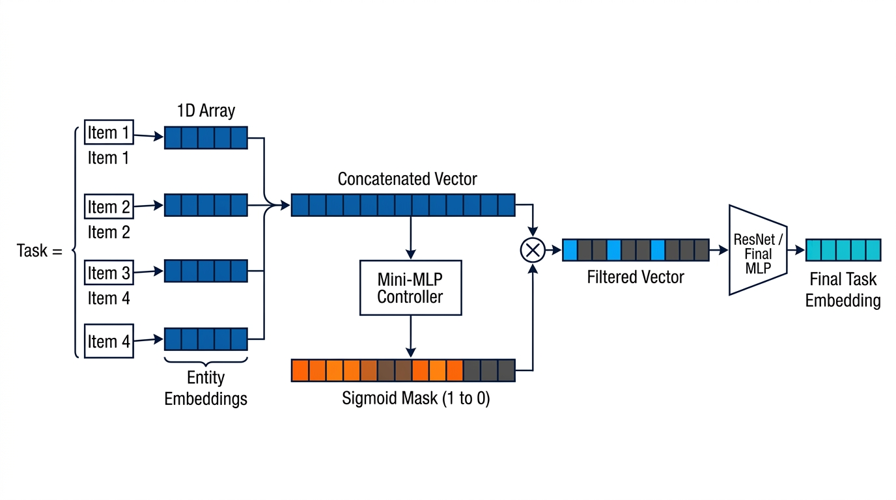
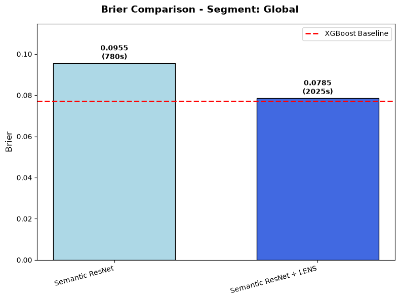

# LENS: Likelihood Estimation via Neighbour Similarity

LENS is an algorithm designed to be coupled with existing neural networks (such as a ResNet), mapping data into a latent space to calculate probabilities empirically. It is specifically built for scenarios involving intrinsic probabilities with human variability and binary outcomes—such as telemarketing calls that either result in a sale or not, where the registry only shows the final binary outcome, but the true objective is predicting the underlying probability of success. 

The primary objective of this architecture is to provide a deep learning algorithm that calibrates probabilities well, while remaining intrinsically interpretable through a case-based approach.

## How LENS Works: Core Concept
At its core, LENS operates by transforming individual instances or data points into vectors within an abstract latent space. The model organizes these vectors based on similarity—clustering closely related items together and pushing distinct ones apart. 

Instead of traditional classification, LENS estimates probabilities empirically for each target instance by looking at its nearest neighbors in this latent space. It assigns weights to these neighbors (giving higher influence to closer ones) and computes the final probability using a weighted average of their outcomes:

$$p = \frac{\sum w_i \cdot \text{Outcome}_i}{\sum w_i}$$

## The Semantic ResNet
To demonstrate this, LENS is applied here to a custom baseline called a **Semantic ResNet**. This architecture is tailored for tabular data by transforming each categorical variable into vectors via entity embeddings, applying a gated network to dynamically "turn off" irrelevant facets of information for a given case, and processing the result through high-capacity ResNet blocks. 


*(Note: The architectural diagram above was generated using AI).*

## Training Dynamics: Mini-Batches and Convergence
A critical challenge in training LENS is the creation of mini-batches. If batches are selected randomly, there is no guarantee that an instance's true nearest neighbors will be present, making empirical probability estimation impossible. 

To solve this, batches are constructed in groups: a random anchor is chosen, its closest neighbors are fetched, and then the neighbors of those neighbors are also gathered. This ensures that anchors act as neighbors for each other, which is mathematically necessary for the global Brier Score to converge properly and for the network to organize the latent space effectively.

## The Dual Loss Function
The loss function acts as the engine that organizes the vectors in the latent space. It consists of two carefully balanced terms:
* **Main Loss (Brier Score):** Calculates the Brier Score for the mini-batch. It is designed to converge globally, smoothing out the natural noise of the dataset (e.g., high-probability instances that simply failed) rather than overfitting to individual, isolated data points.
* **Geometric Repulsion Loss:** Treats vectors like charged particles, applying an exponential repulsion force to items that get too close to one another. This prevents the network from collapsing vectors into tight clusters and stabilizes the empirical predictions.

## Ablation Study & Results
This repository includes an ablation study to prove that the LENS algorithm works effectively. We compare the standard Semantic ResNet against the exact same network equipped with LENS. 

The results show that LENS not only improves the predictive performance but also adds intrinsic interpretability, as predictions can be fully audited by looking at the nearest historical neighbors used for the calculation. As shown in the Brier Score chart below, this deep learning approach successfully closes the gap with highly optimized decision-tree models like XGBoost on tabular data.



## How to Run

### 0. Pre-trained Weights (Optional)
If you prefer to run the evaluation directly without retraining from scratch, pre-trained model weights can be downloaded from the [GitHub Releases](../../releases) page and placed inside the `Models/` directory.

### 1. Installation
```bash
git clone https://github.com/BenatPerez/LENS-v0.git
cd LENS-Architecture
pip install -r requirements.txt
```

### 2. To run the full pipeline (training the ResNet Ablation and LENS models from scratch):
```bash
python train.py
```

### 3. To evaluate the models and generate the comparison charts against XGBoost:
```bash
python evaluation.py
```

## Data Source
This project uses the **Bank Marketing Dataset** from the UCI Machine Learning Repository, made available under the [Creative Commons Attribution 4.0 International (CC BY 4.0) license](https://creativecommons.org/licenses/by/4.0/).

**Citation:**
Moro, S., Rita, P., & Cortez, P. (2012). Bank Marketing [Dataset]. UCI Machine Learning Repository. https://doi.org/10.24432/C5K306

*Note: The original dataset was modified for this project.*

## License & Copyright
© 2026 Beñat Perez Araujo. All rights reserved. 
This repository is published for portfolio and educational review purposes only. Commercial use, reproduction, or redistribution of this code without explicit prior permission is strictly prohibited.
